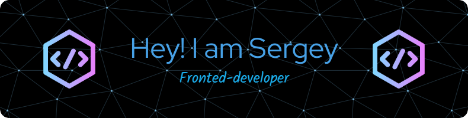

<h1 align="center">Hi 👋, I'm Sergey</h1>
<h3 align="center">A passionate frontend developer from Russia</h3>

  

- 🌱 I’m currently learning **JavaScript,CSS,HTML,Sass**

- 👨‍💻 All of my projects are available at [sergeyfanasyan.ru](sergeyfanasyan.ru)

- 💬 Ask me about **CSS,HTML,JavaScript,Sass**

- 📫 How to reach me **broserega22@gmail.com**

- 📄 Know about my experiences [sergeyfanasyan.ru](https://sergeyfanasyan.ru/)

<h3 align="left">Connect with me:</h3>

<h3 align="left">Languages and Tools:</h3>

          

&nbsp;

